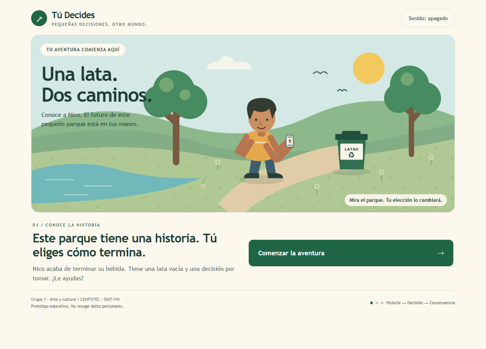

# Mapa de Comunidad · Tú Decides

SINT-741 · Activadores de Comunidades de Práctica · Actividad 2 / Reto de clase 2 · Grupo 1, Arte y cultura

**Revisión documental:** 8 de octubre de 2026. **Estado:** prototipo local construido y motor verificado; validación educativa y acuerdos de continuidad pendientes.

## 1. Propósito, dominio y comunidad

**Pregunta generadora:** ¿Qué objeto maker podría expresar la cultura local?

**Proyecto:** *Tú Decides*, experiencia interactiva de decisiones ambientales con enfoque de videojuego narrativo. La idea inicial de video se concreta primero en un juego sencillo para navegador. La animación 3D, las fotografías del barrio y la música original del grupo quedan como ampliaciones, no como piezas ya producidas.

**Situación planteada:** basura en espacios comunes y dificultad para relacionar pequeñas decisiones con el cuidado del entorno. Es el punto de partida del grupo; falta contrastarlo con participantes del contexto elegido. No es un diagnóstico local ya demostrado.

**Intención compartida:** reunir capacidades de narrativa, diseño, fotografía y música para crear, probar y mejorar juntos experiencias sobre el cuidado del entorno. El juego es un recurso de la comunidad, no el único objetivo.

**Dominio:** aprendizaje y creación colectiva sobre cultura y cuidado del entorno mediante arte digital. **Público principal propuesto:** niños de 6 a 12 años, con acompañamiento adulto. Jóvenes, familias y docentes pueden probar y contribuir. La comprensión y el aprendizaje todavía deben verificarse.

### Participantes y aportes

Son capacidades y responsabilidades propuestas, no una acreditación de piezas ya producidas.

| Participante | Capacidad o aporte |
|---|---|
| Mario Barsallo | Diseño y animación 3D; posibles escenarios, objetos e interfaz. Documentación y exposición. |
| Melvin Buford | Música, producción y enseñanza; posible banda sonora para los dos caminos. |
| Maykol Rodríguez | Fotografía y comunicación con jóvenes; posibles referencias del entorno y convocatoria. |
| Yonathan González | Pasaporte digital de museos; posible entrevista y vínculo con espacios culturales. |
| Grace | Diseño de producto, modelado 3D y narrativa. Aportó la idea de una historia como juego dinámico de decisiones. |
| Mayck | Estudiante de Psicología; interés en fotografía y contenido para redes. Desea apoyar con fotografía. |
| Jimena Londoño | Gestora y segunda coordinadora; seguimiento del rumbo y los acuerdos. |

**Roles confirmados de la actividad:** facilitó Melvin Eugene Buford Bernal; documentó Mario Esteban Barsallo Vasquez; observó la participación Maykol Arcenio Rodriguez Herrera. **Expositor:** Mario Esteban Barsallo Vasquez.

**Por incorporar:** jugadores de prueba, adultos acompañantes, docentes, jóvenes del Clubhouse y personas con experiencia ambiental local. No se afirma que ya participen ni que existan alianzas acordadas.

<!-- pagebreak -->

## 2. Práctica compartida y entrada a la comunidad

**Práctica propuesta:** encuentros para jugar, conversar sobre una decisión del entorno, crear una escena, probarla y documentar una mejora. La periodicidad y la primera convocatoria deben acordarse con el grupo.

### Cómo empieza alguien nuevo

| Trayectoria | Primera acción | Aporte disponible |
|---|---|---|
| Observar / probar | Abrir el juego, elegir un camino y reiniciar para comparar. | Una dificultad o pregunta para la bitácora. |
| Preguntar | Explicar qué cambió y preguntar por qué. | Una duda para revisar la historia o las instrucciones. |
| Contribuir | Proponer una decisión del barrio, dibujar un final o aportar una foto propia autorizada. | Un recurso con autor, contexto y permiso de uso. |
| Acompañar | Ayudar a otra persona a jugar o preparar una escena. | Una explicación reutilizable. |
| Coordinar | Preparar un encuentro y registrar acuerdos. | Una siguiente acción con responsable y fecha acordados. |

**Entrada:** leer las instrucciones de este `mapa-comunidad.md` y abrir `prototipo/Tu-Decides.html`. Para contribuir, compartir la propuesta con la coordinación y registrar el acuerdo. El canal de contacto público y la URL de publicación aún no están confirmados.

### Representación y función mínima

| Historia / decisión | Reciclar | Tirar al suelo |
|---|---|---|
| Un personaje tiene una lata. El jugador escoge entre dos opciones. | Cambian paisaje y texto; se conversa sobre dónde depositar una lata. | Aparece basura y cambia el texto; se invita a reconsiderar la decisión. |

**Función:** una elección produce un final diferente; el reinicio permite comparar los caminos.

**Estado real:** existe un HTML jugable con ilustración SVG, dos finales y sonido generado por Web Audio. No es un video 3D terminado. Nico es un nombre elegido durante la implementación, no un acuerdo confirmado del grupo. El temporizador inicial no está implementado: quedó fuera de la versión mínima. El grupo debe revisar estas decisiones.

**Evidencia:** juego, prueba automatizada, instrucciones y capturas. Las capturas muestran la implementación, no una prueba con niños ni un boceto realizado en clase.

<!-- pagebreak -->

## 3. Infraestructura y documentación reutilizable

La entrega es un paquete local. La publicación y el estado del repositorio de comunidad en GitHub no se han verificado aquí. El paquete no acredita por sí solo toda la infraestructura del proyecto integrador.

### Archivos y función

| Recurso | Función |
|---|---|
| `mapa-comunidad.md` | Única fuente editable: mapa, instrucciones, prueba, continuidad y retroalimentación. |
| `completo.pdf` | Único PDF; versión de lectura del mismo contenido. |
| `prototipo/Tu-Decides.html` | Juego autónomo; funciona sin documentos ni capturas. |
| `prototipo/tests.cjs` | Prueba reproducible del motor; requiere Node.js, sin dependencias adicionales. |
| `prototipo/captura-inicio.png` | Representación visual usada en este documento, no evidencia de prueba educativa. |

**Simplicidad y modularidad:** juego, mapa, prueba y captura tienen funciones distintas. Las instrucciones y los registros se reúnen en este único mapa para evitar documentos repetidos. El HTML reúne interfaz, dibujo, sonido y motor para facilitar su distribución. El motor se identifica como `game-engine` y tiene una prueba independiente. No se afirma que sus componentes internos ya sean módulos separados. Se separarán cuando aporte utilidad, sin carpetas vacías ni complejidad innecesaria.

### Reproducir y adaptar

1. Abrir `prototipo/Tu-Decides.html` con un navegador; para jugar no requiere internet ni instalación.
2. Pulsar **Comenzar la aventura**, elegir **Reciclarla** o **Tirarla al suelo**, observar y pulsar **Volver a jugar**. Las teclas **1** y **2** funcionan durante la decisión.
3. Activar o apagar el sonido con su botón. Si no se escucha, revisar volumen y permiso de audio; la evaluación auditiva humana sigue pendiente.
4. Con Node.js disponible, ejecutar `node --test tests.cjs` desde la carpeta `prototipo`. Guardar la salida real al repetirlo.
5. Editar una copia del HTML: textos en `const text`, reglas en `game-engine`, dibujo en el SVG y sonido en `tone()`. Repetir la prueba y registrar el cambio antes de sustituir la versión compartida.

**Recursos actuales:** HTML, CSS, JavaScript, SVG, Web Audio y Node.js. Blender, fotos locales y música del grupo son propuestas de ampliación, no dependencias actuales.

**Autoría y permisos:** conservar créditos de cada aporte. No reutilizar fotografías ajenas ni imágenes identificables de menores sin autorización. La licencia pública del conjunto sigue por acordar.

<!-- pagebreak -->

## 4. Experimentación y conversión de flow en stock

### Verificación técnica de esta revisión

Se ejecutó `node --test tests.cjs` el **8 de octubre de 2026**: **1 prueba aprobada, 0 fallidas; código de salida 0**. Comprueba inicio, dos decisiones, finales distintos y reinicio del motor.

**Límite:** no comprueba por sí sola clics reales, reproducción audible, usabilidad, aprendizaje ni todos los navegadores. La documentación de trabajo registra una verificación previa en Edge, vista móvil y dos correcciones de posición de animaciones SVG. Esa documentación queda fuera del paquete de entrega; esa revisión de interfaz no se repitió durante esta reparación documental.

**Aprendizaje técnico:** la bifurcación existe en el código y pasa la prueba del motor. **Aprendizaje educativo:** no comprobado. La prueba con niños y con el grupo sigue pendiente; no se atribuyen al grupo pruebas que no realizó.

### Prueba educativa propuesta — pendiente de acuerdo

**Pregunta:** ¿una persona del público previsto identifica las opciones, distingue los finales y explica su decisión sin que le indiquemos qué responder?

1. Confirmar participantes, fecha, lugar y responsables; organizar acompañamiento adulto y autorizaciones pertinentes.
2. Pedir que jueguen sin señalar una respuesta correcta. Observar controles y ayuda necesaria.
3. Pedir que prueben ambos caminos y describan los cambios con sus palabras.
4. Preguntar qué harían con una lata en su entorno y por qué. Jugar no demuestra por sí solo cambios de conducta fuera del juego.
5. Registrar una dificultad, acordar una mejora y volver a probarla.

| Qué observar | Registro propuesto |
|---|---|
| Encuentra y activa las opciones | Sin ayuda / con ayuda / no lo logra; anotar dificultad. |
| Distingue las consecuencias | Descripción de ambos finales sin completar la respuesta. |
| Explica su elección | Respuesta anónima o paráfrasis, sin inventar conclusiones. |
| Aporta o pregunta | Duda, dibujo o nueva decisión. |
| La mejora funciona | Comparar la dificultad antes y después del cambio. |

**Registro integrado en este mapa:** fecha y versión, responsable, observación real, dificultad, cambio y resultado de repetir la prueba. Todos esos resultados educativos siguen pendientes. No registrar nombres de menores en documentos compartidos. Sin resultados, no se calcula éxito ni se asegura adecuación a todas las edades.

### Flow, stock y uso de IA

**Flow:** conversaciones, dudas, ejecución y comentarios de prueba. **Stock actual:** mapa, juego, instrucciones, prueba automatizada, capturas y plantillas. **Stock pendiente:** observaciones educativas reales, decisiones justificadas y guía actualizada después de una mejora.

ChatGPT apoyó la organización inicial. Hermes Agent ayudó a programar el prototipo, generar ilustración y sonido y preparar pruebas e instrucciones; en esta revisión ejecutó la prueba del motor y sincronizó los documentos. El grupo debe revisar qué acepta y modifica. La IA no reemplaza la validación con personas ni constituye una prueba educativa.

<!-- pagebreak -->

## 5. Continuidad y retroalimentación

### Plan propuesto

La presentación indicada para el **8 de octubre de 2026** es un acuerdo registrado; no se afirma que ya haya ocurrido. Mario es el expositor confirmado. La prueba se propuso para un sábado, sin fecha exacta ni equipo confirmado.

| Próximo paso | Responsable / estado | Evidencia esperada |
|---|---|---|
| Revisar el prototipo y sus simplificaciones | Grupo 1; Jimena dará seguimiento como segunda coordinadora. | Comentarios y cambios aceptados. |
| Acordar convocatoria y prueba | Responsables por confirmar, no asignados automáticamente. | Fecha, lugar y responsabilidades. |
| Realizar la prueba educativa | Pendiente de acuerdo y ejecución. | Observaciones reales en la bitácora. |
| Aplicar una mejora y repetir | Grupo 1; responsable técnico por acordar. | Diferencia entre versiones y nueva prueba. |
| Acordar publicación y siguiente encuentro | Coordinación y grupo; fecha sin confirmar. | Acceso, permisos y siguiente acción. |

**Continuar sin Mario:** se propone que el grupo tenga acceso a los archivos y designe una coordinación alternativa por encuentro. Quien asuma el relevo podrá leer las instrucciones de este mapa, reproducir el motor, consultar sus registros, escoger un pendiente y registrar un acuerdo. Jimena puede dar seguimiento; no se presume que tenga permisos de administración del repositorio.

**Autonomía:** se propone alternar convocatoria, facilitación, documentación y revisión, con aceptación expresa de quienes las asuman. Otra persona podrá aportar una escena o facilitar una prueba. Accesos, relevo, licencia y periodicidad todavía deben acordarse: no se presenta sostenibilidad ya demostrada.

**Señales por observar:** personas que regresan, ayuda entre participantes, recursos reutilizados y propuestas lideradas por otra persona. Sin mediciones todavía.

### Retroalimentación incorporada

| Comentario de Mario | Cambio realizado | Límite |
|---|---|---|
| Enfocar como videojuego de decisiones. | Separación entre juego mínimo y video 3D futuro. | No es evaluación del profesor. |
| Jimena como segunda coordinadora; Mario expositor. | Roles y continuidad corregidos. | Equipo de prueba aún sin confirmar. |
| Prueba en sábado tentativo; no inventar resultados. | Separación entre acuerdos, propuestas, pruebas técnicas y educativas. | Sin fecha exacta ni observaciones educativas. |
| Seguir la rúbrica completa y enfocar la comunidad. | Entrada accionable, recursos, reproducción, continuidad y matriz. | Revisión del grupo y evaluación pendientes. |

El criterio institucional requiere seguimiento a lo largo del curso. Estos cambios no demuestran que se haya incorporado toda la retroalimentación docente. Registrar aquí los comentarios posteriores: fecha, origen, comentario, decisión del grupo, cambio aplicado y verificación de su efecto. Retroalimentación docente: pendiente de recibir o documentar.

<!-- pagebreak -->

## 6. Revisión frente a la rúbrica oficial

**Referencia:** *Rúbrica del proyecto integrador: Construcción e Implementación de la Infraestructura y Plan de Activación de Comunidad (`mi-comunidad`)*, SINT-741, Universidad Cenfotec, adaptación de Tomás de Camino Beck. Se usa el texto completo aportado por Mario. Evalúa el proyecto integrador, no solo este PDF.

| Criterio | Evidencia disponible | Brecha / comprobación pendiente |
|---|---|---|
| 1. Diseño del dominio y las trayectorias de participación | Propósito, capacidades y acciones concretas de entrada y contribución. | Contrastar necesidad local, confirmar canal y verificar incorporación de alguien nuevo. |
| 2. Simplicidad y modularidad de la infraestructura | Índice, juego autónomo, motor identificable y registros consolidados en el mapa. | Verificar repositorio publicado y reutilización; un HTML único no equivale a módulos internos independientes. |
| 3. Transparencia y documentación | Guía integrada en el mapa, instrucciones de reproducción y adaptación; autoría y límites. | Reproducción por alguien externo sin ayuda adicional; acordar permisos y licencia. |
| 4. Experimentación y aprovechamiento de recursos | Prototipo, prueba del motor aprobada, capturas y registro previo de correcciones; recursos reutilizables. | Prueba educativa, observaciones, corrección y repetición; el test no demuestra aprendizaje infantil. |
| 5. Diseño para la evolución y la continuidad de la comunidad | Plan de relevo, tareas rotativas propuestas y pasos documentados. | Acordar accesos, responsables y calendario; verificar liderazgo sin el autor original. |
| 6. Acatamiento de la retroalimentación | Cambios solicitados por Mario registrados y pauta de seguimiento integrada. | Incorporar y verificar comentarios del grupo y profesor a lo largo del curso. |

**Resultado documental:** se atienden los seis criterios mostrando evidencia y brechas. No se asigna nota ni se declara cumplimiento satisfactorio total: participación, pruebas y acuerdos reales no pueden sustituirse con redacción.

### Pendientes para completar la evidencia

- Validar propósito y contexto con participantes.
- Revisar y aceptar el prototipo con el Grupo 1.
- Confirmar fecha, responsables y acompañamiento de la prueba educativa.
- Registrar resultados reales, aplicar y volver a probar una mejora.
- Verificar publicación y acceso, autoría y permisos de reutilización.
- Acordar relevo, siguiente encuentro y continuidad sin depender del autor.
- Registrar e incorporar retroalimentación docente y del grupo.

### Referencia de consulta y control documental

Repositorio del curso: `Universidad-Cenfotec/SINT-741-Curso-Activadores`; documento `2. Documentos/rubrica_proyecto_cenfotec.md`.

`mapa-comunidad.md` es la única fuente editable de esta entrega; `completo.pdf` es su única copia en PDF. El prototipo y su captura acreditan implementación, no participación de niños. Las instrucciones, la bitácora y la retroalimentación están integradas en este mapa. Los archivos de trabajo y el guion personal quedan fuera de la carpeta `entrega`.
